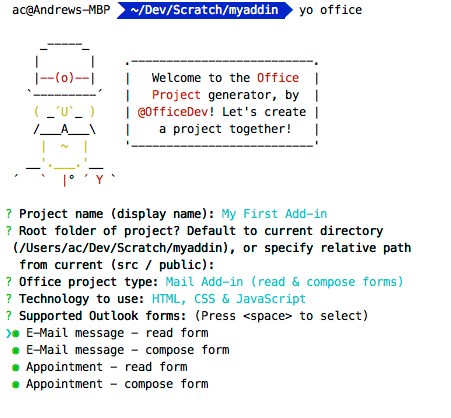

# Microsoft Office Project Generator - YO OFFICE!

[](http://badge.fury.io/js/generator-office)
[](https://npmjs.org/package/generator-office)
[](https://travis-ci.org/OfficeDev/generator-office)
[](https://coveralls.io/github/OfficeDev/generator-office?branch=master)
[](https://david-dm.org/officedev/generator-office)
[](https://david-dm.org/officedev/generator-office#info=devDependencies)
[](http://officedev.herokuapp.com/)

[Yeoman](http://yeoman.io) generator for creating Microsoft Office projects using any text editor. Microsoft includes fantastic & [rich development tools for creating Office related projects using Visual Studio 2013](http://aka.ms/OfficeDevToolsForVS2013) or [tools for Visual Studio 2015](http://aka.ms/OfficeDevToolsForVS2015). This generator is for those developers who:

- use a editor other than Visual Studio
- interested in using a technology other than plain HTML, CSS & JavaScript

Like other Yeoman generators, this simply creates the scaffolding of files for your Office project. It allows you to create:

- Office Mail Add-ins (both read & compose forms)
- Office Task Pane Add-ins
- Office Content Add-ins

Choose to create the Office projects using plain HTML, CSS & JavaScript (*mirroring the same projects that Visual Studio creates*) or create Angular-based projects.

Check out the announcement blog post: [Office Dev Center Blog - Creating Office Add-ins with any editor - Introducing YO OFFICE!](http://dev.office.com/blogs/creating-office-add-ins-with-any-editor-introducing-yo-office) 

Read up on [how to use the generator to create Office Add-ins with Visual Studio Code](https://code.visualstudio.com/Docs/runtimes/office).

If you are interested in contributing, read the the [Contributing Guidelines](docs/contributing.md). 

## YO Office Demo (screenshot & video)


<iframe width="560" height="315" src="https://www.youtube.com/embed/78b18BLVosM" frameborder="0" allowfullscreen></iframe>

***

## Install

Install `yo` (Yeoman) and `generator-office` globally using NPM (this also requires [Node.js](https://nodejs.org). The project files created by the generator leverage client side packages in [bower](http://bower.io) so you will want to install that as well:

```bash
$ npm install -g yo generator-office bower
```

## Usage

```bash
$ yo office [options]
```

The generator is intented to be run from within a folder where you want the project scaffolding created. This can be in the root of the current folder or within a subfolder.

> Note: Office Add-ins must be hosted, even in development, in a **HTTPS** site. You can create a simple HTTPS hosted site using Node.js using the [nodehttps](https://www.npmjs.com/package/generator-nodehttps) generator. 

## Sub Generators

Running the main generator will prompt you for the type of Office project to create. This triggers the execution of one of the included sub generators. You can instead call one of these sub generators directly to bypass that question:

  - `office:mail` - creates a Mail Add-in
  - `office:taskpane` - creates a Task Pane Add-in
  - `office:content` - creates a Content Add-in

> Remember you can see the options of each sub generators by running `$ yo office:[sub] --help`

## Running the Generated Site

All generators create a `gulpfile.js`. This uses the [gulp-webserver](https://www.npmjs.com/package/gulp-webserver) task to start a HTTPS server. This server includes a self-signed SSL cert that your development enviroment must trust (this involves adding it to your trusted root certificates). Start the local HTTPS site on `https://localhost:8443/` and launch a browser to this site using:

```bash
$ gulp serve-static
```

You can add the `open` property set to a URL to have your default browser open & navigate to when running this task.

## Examples

Refer to the [docs](docs) for example executions & output of the generator.## Command Line Options:

List of supported options. If these are not provided, the generator will prompt you for the values before scaffolding the project.

> For a full list of all options & descriptions, run `yo office --help`

### `--skip-install`

After scaffolding the project, the generator (and all sub generators) run all package management install commands such as `npm install` & `bower install`. Specifying `--skip-install` tells the generator to skip this step.

  - Type: Boolean
  - Default: False
  - Optional

### `--name:'..'`

Title of the project - this is the display name that is written the `manifest.xml` file.

  - Type: String
  - Default: undefined / null
  - Optional

### `--root-path:'..'`

Relative path where the project should be created (blank = current directory). If specifying a subfolder, use a relative path. For instance, if you are currently in the `MyProject` folder specify `src/public` to create the addin in `MyProject/src/public`.

  - Type: String
  - Default: undefined / null
  - Optional  

### `--tech:[ 'html' | 'ng' | 'ng-adal' | 'manifest-only' ]`

Technology to use for the project. The supported options include HTML (`html`), Angular (`ng`) or Angular ADAL (`ng-adal`). You can also use Manifest.xml only (`manifest-only`) which will create only the `manifest.xml` for an an Office addin.

  - Type: String
  - Default: undefined / null
  - Optional  

### `--clients: [ 'Document' | 'Workbook' | 'Presentation' | 'Project' ]`

The Microsoft Office client application that can host the add-in. 

> This applies only to task pane or content add-ins.

  - Type: String[]
  - Default: undefined / null
  - Optional  

### `--outlookForm: [ 'mail-read' | 'mail-compose' | 'appointment-read' | 'appointment-compose' ]`

The type of form within Outlook that can host the add-in. 

> This applies only to mail add-ins.

  - Type: String[]
  - Default: undefined / null
  - Optional  