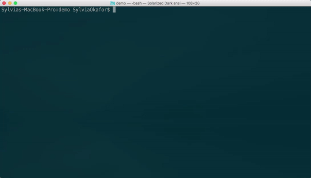

# Microsoft Office Add-in Project Generator - YO OFFICE!

[](http://badge.fury.io/js/generator-office)
[](https://npmjs.org/package/generator-office)
[](https://travis-ci.org/OfficeDev/generator-office)

[Yeoman](http://yeoman.io) generator for creating [Microsoft Office Add-in](https://dev.office.com/docs/add-ins/overview/office-add-ins) projects using any text editor. Microsoft includes fantastic & [rich development tools for creating Office related projects using Visual Studio 2013](http://aka.ms/OfficeDevToolsForVS2013) or [tools for Visual Studio 2015](http://aka.ms/OfficeDevToolsForVS2015). This generator is for those developers who:

- use an editor other than Visual Studio
- are interested in using a technology other than plain HTML, CSS & JavaScript

> If you are building an Angular or React add-in and would like to learn more about using Yo Office specifically for those frameworks, see [Build an Add-in with React](https://dev.office.com/docs/add-ins/excel/excel-add-ins-get-started-react) or [Build an Add-in with Angular](https://dev.office.com/docs/add-ins/excel/excel-add-ins-get-started-angular).

Like other Yeoman generators, this simply creates the scaffolding of files for your Office project. It allows you to create add-ins for:

- Excel
- OneNote
- Outlook
- PowerPoint
- Project
- Word

Choose to create the Office projects using plain HTML, CSS & JavaScript (*mirroring the same projects that Visual Studio creates*) or create Angular-based projects.

If you are interested in contributing, read the [Contributing Guidelines](CONTRIBUTING.md). 

## YO Office Demo


## Install

> **Important:** If this is the first time you're using Yeoman or installing a Yeoman generator, first install [Git](https://git-scm.com/download) and [Node.js](https://nodejs.org). For developers on Mac, we recommend using [Node Version Manager](https://github.com/creationix/nvm) to install Node.js with the right permissions. When the installation completes, restart your console (or if you are using Windows, restart your machine) to ensure you use the updated system environment variables.

Install `yo` (Yeoman) and `generator-office` globally using NPM.

```bash
$ npm install -g yo generator-office
```

## Usage

```bash
$ yo office [arguments] [options]
```

The generator is intended to be run from within a folder where you want the project scaffolding created. This can be in the root of the current folder or within a subfolder.

## Running the Generated Site

Office Add-ins must be hosted, even in development, in a HTTPS site. Yo Office creates a `bsconfig.json`, which uses [Browsersync](https://browsersync.io/) to make your tweaking and testing faster by synchronizing file changes across multiple devices. 
  		  
Launch the local HTTPS site on `https://localhost:3000` by simply typing the following command in your console:

```bash
$ npm start
```

Browsersync will start a HTTPS server, which includes a self-signed SSL cert that your development environment must trust. Refer to our doc, [Adding Self-Signed Certificates as Trusted Root Certificate](src/docs/ssl.md), for instructions on how to do this.

> **Important:** You may still face issue with the Browsersync self-signed SSL certificated since the certificate is signed for domain "Internet Widgits Pty Ltd" instead of localhost. See [this issue](https://github.com/OfficeDev/generator-office/issues/244) for more details and temporary workaround.

Browse to the 'External' IP address listed in your console to test your web app across multiple browsers and devices that are connected on your local network.


## Validate manifest.xml

As you modify your `manifest.xml` file, use the included [Office Add-in Validator](https://github.com/OfficeDev/office-addin-validator) to ensure that your XML file is correct and complete. It will also give you information on against what platforms to test your add-ins before submitting to the store.

To run Office Add-in Validator, use the following command in your project directory:
```bash
$ npm run validate your_manifest.xml
```


For more information on manifest validation, refer to our [add-in manifests documentation](https://dev.office.com/docs/add-ins/overview/add-in-manifests).

## Command Line Arguments:
List of supported arguments. The generator will prompt you accordingly based on the arguments you provided.

### `name`
Title of the project - this is the display name that is written the manifest.xml file.
  - Type: String
  - Optional
 
>**Note:** The Windows command prompt requires this argument to be in quotes (e.g. "My Office Add-in")

### `host`
The Microsoft Office client application that can host the add-in. The supported arguments include Excel (`excel`), OneNote (`onenote`), Outlook (`outlook`), PowerPoint (`powerpoint`), Project (`project`), and Word (`word`).
  - Type: String
  - Optional

### `framework`
Framework to use for the project. The supported arguments include JQuery (`jquery`), Angular (`angular`), and React (`react`). You can also use Manifest Only (`manifest-only`) which will create only the `manifest.xml` for an Office Add-in.
  - Type: String
  - Optional

## Command Line Options:
List of supported options. If these are not provided, the generator will prompt you for the values before scaffolding the project.

### `--skip-install`

After scaffolding the project, the generator (and all sub generators) run all package management install commands such as `npm install` & `typings install`. Specifying `--skip-install` tells the generator to skip this step.

  - Type: Boolean
  - Default: False
  - Optional

### `--js`

Specifying `--js` tells the generator to use JavaScript.

  - Type: Boolean
  - Default: False
  - Optional

>**Note:** Do not use this flag when you pass `react` as framework argument.

Copyright (c) 2017 Microsoft Corporation. All rights reserved.
