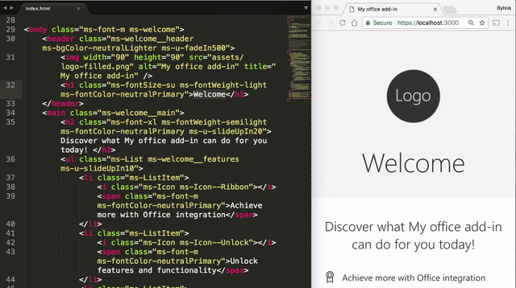

# Microsoft Office Project Generator - YO OFFICE!

[Yeoman](http://yeoman.io) generator for creating Microsoft Office projects using any text editor. Microsoft includes fantastic & [rich development tools for creating Office related projects using Visual Studio 2013](http://aka.ms/OfficeDevToolsForVS2013) or [tools for Visual Studio 2015](http://aka.ms/OfficeDevToolsForVS2015). This generator is for those developers who:

- use an editor other than Visual Studio
- are interested in using a technology other than plain HTML, CSS & JavaScript

Like other Yeoman generators, this simply creates the scaffolding of files for your Office project. It allows you to create Add-ins for:

- Excel
- OneNote
- Outlook
- PowerPoint
- Project
- Word

Choose to create the Office projects using plain HTML, CSS & JavaScript (*mirroring the same projects that Visual Studio creates*) or create Angular-based projects.

If you are interested in contributing, read the [Contributing Guidelines](CONTRIBUTING.md). 

## YO Office Demo (screenshot & video)


<iframe width="560" height="315" src="https://www.youtube.com/embed/78b18BLVosM" frameborder="0" allowfullscreen></iframe>

***

## Install

> **Important:** If this is the first time you're using Yeoman or installing a Yeoman generator, first install [Git](https://git-scm.com/download) and [npm](https://nodejs.org). When the installation completes, restart your console (or if you are using Windows, restart your machine) to ensure you use the updated system environment variables.

Install `yo` (Yeoman) and `generator-office` globally using NPM.

```bash
$ npm install -g yo generator-office@1.0.0-beta.1
```

## Usage

```bash
$ yo office [arguments] [options]
```

The generator is intended to be run from within a folder where you want the project scaffolding created. This can be in the root of the current folder or within a subfolder.

## Running the Generated Site

Office Add-ins must be hosted, even in development, in a HTTPS site. Yo Office creates a `bsconfig.json`, which uses [Browsersync](https://browsersync.io/) to make your tweaking and testing faster by synchronizing file changes across multiple devices. 
  		  
Launch the local HTTPS site on `https://localhost:3000` by simply typing the following command in your console:

```bash
$ npm start
```

Browsersync will start a HTTPS server, which includes a self-signed SSL cert that your development environment must trust. Refer to our doc [Adding Self-Signed Certificates as Trusted Root Certificate](src/docs/ssl.md) for instructions on how to do this.

Browse to the 'External' IP address listed in your console to test your web app across multiple browsers and devices that are connected on your local network.



## Validate manifest.xml

Refer to the docs on [Add-in manifests](https://dev.office.com/docs/add-ins/overview/add-in-manifests) for information of manifest validation.

## Command Line Arguments:
List of supported arguments. The generator will prompt you accordingly based on the arguments you provided.

### `name`
Title of the project - this is the display name that is written the manifest.xml file.
  - Type: String
  - Optional

### `host`
The Microsoft Office client application that can host the add-in. The supported arguments include Excel (`excel`), OneNote (`onenote`), Outlook (`outlook`), PowerPoint (`powerpoint`), Project (`project`), and Word (`word`).
  - Type: String
  - Optional

### `framework`
Framework to use for the project. The supported arguments include JQuery (`jquery`), and Angular (`angular`). You can also use Manifest Only (`manifest-only`) which will create only the `manifest.xml` for an Office Add-in.
  - Type: String
  - Optional

## Command Line Options:
List of supported options. If these are not provided, the generator will prompt you for the values before scaffolding the project.

### `--skip-install`

After scaffolding the project, the generator (and all sub generators) run all package management install commands such as `npm install` & `typings install`. Specifying `--skip-install` tells the generator to skip this step.

  - Type: Boolean
  - Default: False
  - Optional

### `--js`

Specifying `--js` tells the generator to use JavaScript.

  - Type: Boolean
  - Default: False
  - Optional

Copyright (c) 2017 Microsoft Corporation. All rights reserved.
