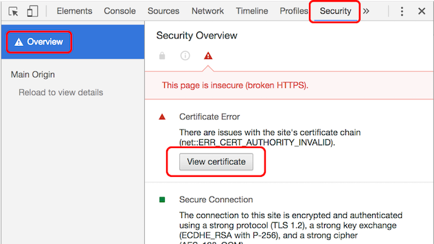
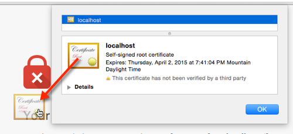
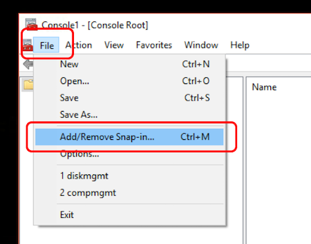
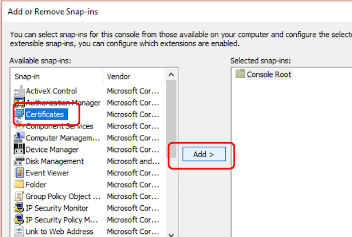
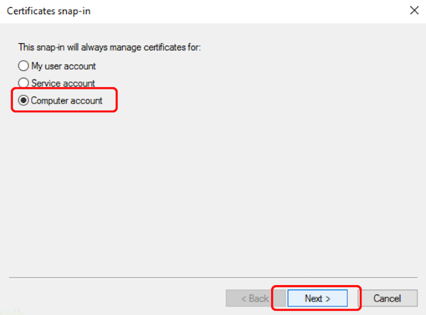
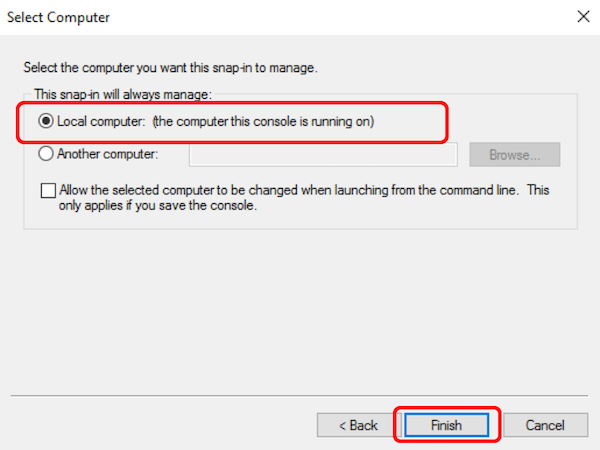
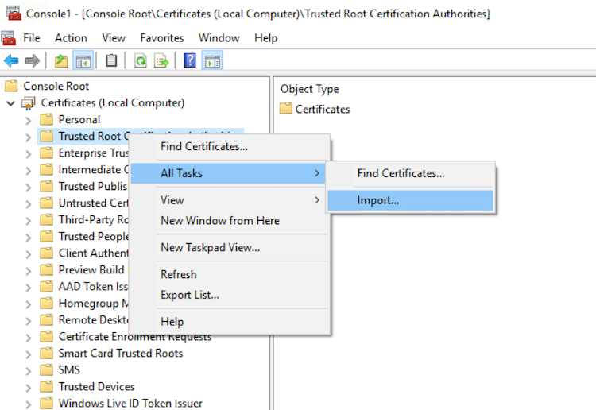

# Adding Self-Signed Certificates as Trusted Root Certificate

Office clients require add-ins and webpages to come from a trusted and secure location. This generator leverages [Browsersync](https://browsersync.io/) to start a web server, which requires a self-signed certificate. Your workstation will not trust this certificate and thus, the Office client, in which you are running your Office Add-in, will not load your add-in.

 When you browse to a site that has an untrusted certificate, the browser will display an error with the certificate:
  		  
   
   
   
   
 To fix this, you need to configure your developer workstation to trust the self-signed certificate. The steps for this differ depending on your developer environment (OSX / Windows / Linux). Use these instructions to trust the certificate:
 
## [OS X](https://support.apple.com/kb/PH18677)

#### Get certificate in Chrome

1. Start Chrome and do the following:

  1. Open Developer Tools window by using keybaord shortcuts: Cmd + Opt + I.
  1. Click to go to 'security' panel and 'overview' screen.
	1. Click 'View certificate'.

  

1. Click and drag the image to your desktop. It looks like a little certificate.

  

#### Get certificate file from project directory

You can locate the server.crt file at **~/your_yo_office_project/node_modules/browser-sync/lib/server/certs/server.crt**

#### Add certification file to Key Chain Access

1. Open the **Keychain Access** utility in OS X.
  1. Select the **System** option on the left.
  1. Click the lock icon in the upper-left corner to enable changes.

  

  1. Click the plus button at the bottom and select the **localhost.cer** file you copied to the desktop.
  1. In the dialog that comes up, click **Always Trust**.
  1. After **localhost** gets added to the **System** keychain, double-click it to open it again.
  1. Expand the **Trust** section and for the first option, pick **Always Trust**.

  
  
At this point everything has been configured. Quit all browsers, then reopen and try to navigate to the local HTTPS site. The browser should report it as a valid certificate:

  

## [Windows](https://technet.microsoft.com/en-us/library/cc754841.aspx)

#### Get certificate file from project directory

You can locate the server.crt file at **~/your_yo_office_project/node_modules/browser-sync/lib/server/certs/server.crt**

#### Add certification file to Key Chain Access

1. Click **Start**, go to **Search box**, type **run**, then type **mmc** in the input field, and then press **ENTER**.
1. On the **File** menu, click **Add/Remove Snap-in**.

  

1. Under **Available snap-ins**, click **Certificates**, and then click **Add**.

  

1. Under **This snap-in will always manage certificates for**, click **Computer account**, and then click **Next**.

  

1. Click **Local computer**, and click **Finish**.

  

1. If you have no more snap-ins to add to the console, click **OK**.
1. In the console tree, double-click **Certificates**.
1. Right-click the **Trusted Root Certification Authorities** store.
1. Click **All Tasks** then **Import** to import the certificates and follow the steps in the Certificate Import Wizard.

  

1. Find server.crt file and click **Open**.
1. Follow the rest of the steps to finish Certificate import.

You now have a self-signed certificate installed on your machine.

Copyright (c) 2017 Microsoft Corporation. All rights reserved.